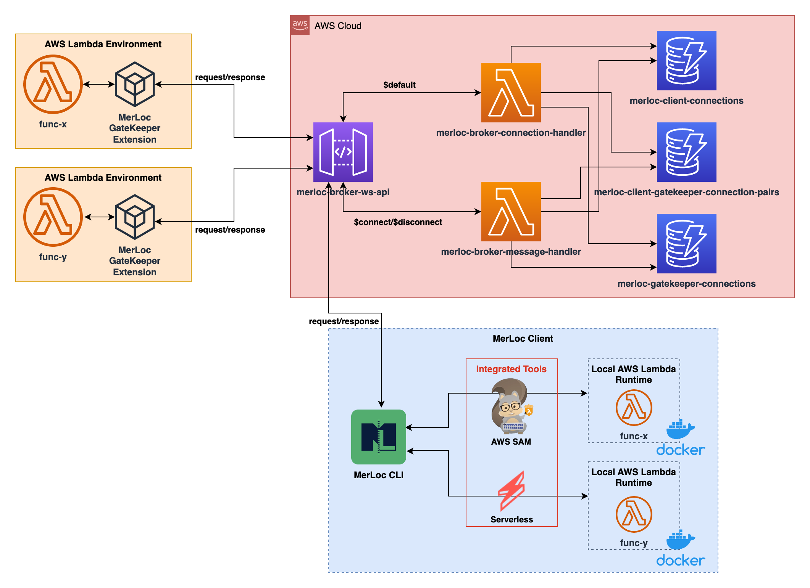
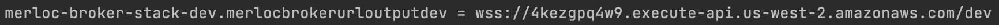

# MerLoc


**MerLoc** is a live AWS Lambda function development and debugging tool. 
MerLoc allows you to run AWS Lambda functions on your local while they are still part of a flow in the AWS cloud remote.

For example, let say that you have the following sample serverless architecture for your order application in your AWS account.


And you are developing the `order-notification-service`.

With the help of MerLoc, you don’t need to
- deploy to test your function
- add debug log statements around code to debug your function
- re-deploy after every change to check and verify whether it fixes the bug
- run the function as standalone (without being part of the flow shown above) locally in Docker locally and prepare/provide the input manually

MerLoc makes it possible to
- test your function locally without deploy to the AWS Lambda environment (so no wait for build, package and deploy)
- debug your function by putting breakpoints from your IDE
- hot-reload updated function on your local automatically to apply changes automatically (so again no wait for build, package and deploy)
- run the individual function locally while it is still part of flow shown above and use real requests from the AWS Lambda environment

Additionally, MerLoc propagates IAM credentials from the real AWS Lambda environment to your local 
so your local function runs with the same credentials. 
So this means that you can also test and verify IAM permission issues on your local.

In the example shown above, when you run `order-notification-service` locally with MerLoc, 
`order-request-service` and `order-processing-service` will run on real AWS Lambda environment, 
and you will get real published message (by `order-processing-service`) from real `order-notification-topic` 
on your local `order-notification-service` and run as a part of real flow in the cloud.

## Architecture



## Prerequisites
- Node.js 14+
- AWS CDK 2.x
- Docker

## Broker Setup

- Go to broker stack deploy folder
```
cd merloc-broker/stack
```

- Start deploy
```
./deploy.sh
```

Make sure that Docker is up and running before running this command as Docker is used to compile and build broker Lambda functions.

If you want to configure the region to deploy the broker, you can specify it by environment variable. 
For example to deploy the broker into us-west-2 region:
```
AWS_REGION=us-west-2 ./deploy.sh
```

- Note the broker url. Because we will use this url later to configure the MerLoc AWS Lambda runtime and the MerLoc GateKeeper.

Either you can get it from the AWS CDK outputs, for ex:


or from the AWS CloudFormation output, for ex:


## Runtime Setup

After broker setup is complete, you also need to install following runtime specific (Java, Node.js, Python, ...) components (as shown in the [Architecture](#architecture) section):
- **GateKeeper**: Allows AWS Lambda functions to communicate with your local runtime through broker
- **Local AWS Lambda runtime**: Manages and runs WS Lambda functions on your local

While broker is common for all runtimes, these components need to be installed per supported runtime.

You can check the following links for runtime specific setup for supported runtimes:
- [Java Runtime Support](https://github.com/thundra-io/merloc-java)

## Configuration

There are default configurations for the broker in the `merloc-broker/stack/.env` file.
To change the broker configurations, you can update the values in the `.env` file here 
and re-deploy the stack by running `deploy.sh`.

## Contributing

Everyone is very welcome to contribute to this repository.
Feel free to [raise issues](https://github.com/thundra-io/merloc/issues)
or to [submit Pull Requests](https://github.com/thundra-io/merloc/pulls).

## License

Licensed under [Apache License 2.0](LICENSE).